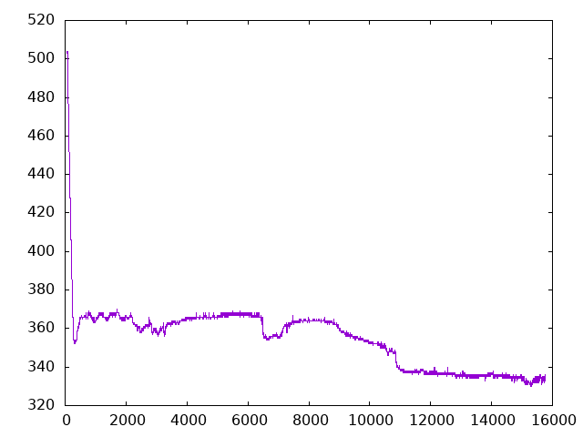
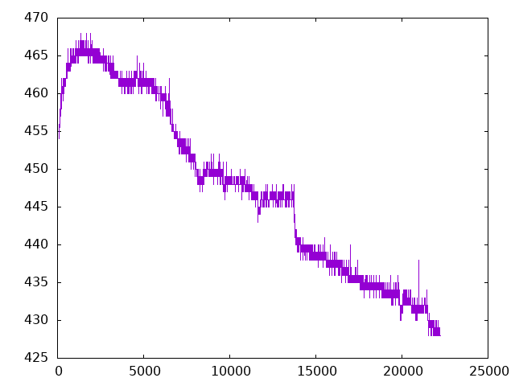

+++
title = "Example Measurements of a Capacitive Soil Moisture Sensor"
tags = [
    "plant",
    "moisture",
    "capacitive",
    "smarthome",
    "iot",
]
date = "2019-08-02"
+++

To understand how the capacitive soil moisture sensor reacts to changes and to have a basic idea how real values look like, I ran a measurement of a small Basil plant.
<!--more-->

Approximately every second, a measurement was taken using a sensor labeled "Capacitive Soil Moisture Sensor V1.2". The plant was protected from direct sunlight and other external influences.

To measure these values, I used an Attiny85 with its ADC set to 10 bit mode, thus, the value range is 0 - 1023.

There are two sets of data, the first one was recorded for about 6 hours after watering the pretty drained soil: \
https://gist.github.com/Pfarrer/303e3cfef6fdb7a517445e918ea124a9 \
The first column of the CSV file is a counter, the _seconds_ column is the measured value. I watered right at counter value 80.

The second set of data was taken on the next day, without watering again:
https://gist.github.com/Pfarrer/c2ec64b651fd8dd0df9e79204a102924

I am not entirely sure why the value continues to decrease, and therefore, the moisture in the soil to rise even though no additional water was added. I assume that the plant and the soil cooled down after moving it from a sunny place to my measuring location that was protected from direct sunlight.
