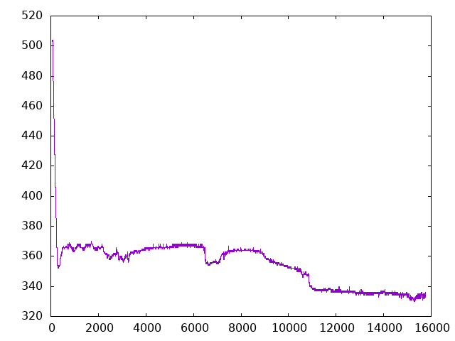

+++
title = "Example Measurements of a Capacitive Soil Moisture Sensor"
tags = [
    "plant",
    "smarthome",
    "iot",
]
date = "2020-06-02"
+++

To understand how the capacitive soil moisture sensor reacts to changes and to have basic idea how real values look like, I ran an measurement of a small Basil plant. Approximately every second, a measurement was taken using a sensor labeled "Capacitive Soil Moisture Sensor V1.2". The plant was protected from direct sun light and other external influences.

To measure these values, I used an Attiny85 with its ADC set to 10 bit mode, thus, the value range is 0 - 1023.

There are two sets of data, the first one was recorded for about 6 hours after watering the pretty drained soil: \
https://gist.github.com/Pfarrer/303e3cfef6fdb7a517445e918ea124a9 \
The first column of the CSV file is a counter, the seconds column is the measured value. I watered right at counter value 80.

The second set of data was taken on the next day, without watering again:
https://gist.github.com/Pfarrer/c2ec64b651fd8dd0df9e79204a102924

I am not entirely sure why the value continues to decrease, and therefore, the moisture in the soil to rise even though no additional water was added. My assumption is that the plant and the soil cooled down after moving it from a sunny place to my measuring location that was protected from direct sun light.
