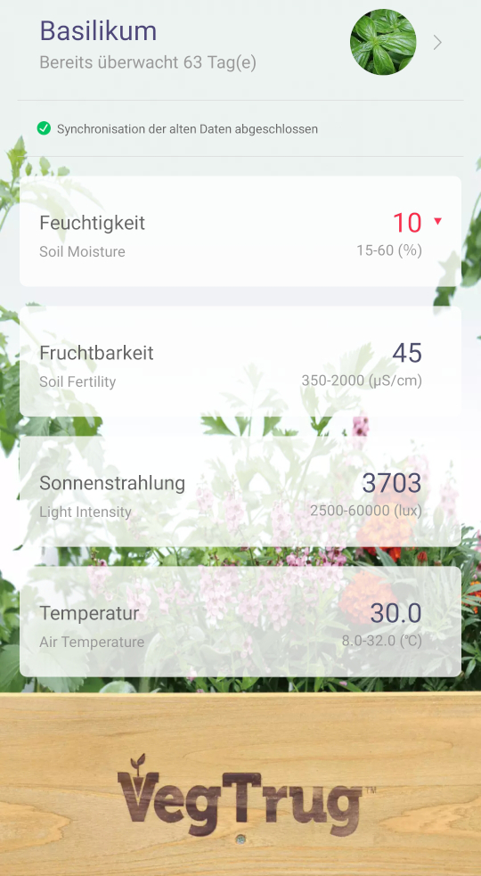
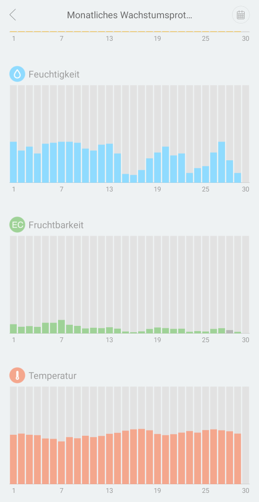

+++
title = "Plant Monitoring with VegTrug Xiaomi Mi Flora sensor and a Rasperry Pi 4"
date = "2020-06-29"
tags = [
    "plant",
    "monitoring",
    "analytics",
    "xiaomi",
    "miflora",
    "vegtrug",
    "rasperrypi",
    "grafana",
    "influxdb",
    "docker",
]
+++

Xiaomi offers a simple and cheap flower sensor that can measure 4 different properties:
soil moisture & fertility, light and temerature.

The _VegTrug Grow Care_ app is compatible to these sensors and can easily conntect via Bluetooth.
It shows the current levels for the 4 available properties plus the battery level.
The app even keeps historic data to show the trend over the period of a day, week or month.

By design, an App based solution has a few deficits, for instance, no monitoring is possible when
the smartphone is not near the sensors. Therefore, alerting is not possible except when being near
the plant, which kind of contradicts the purpose of automatic alerts.
