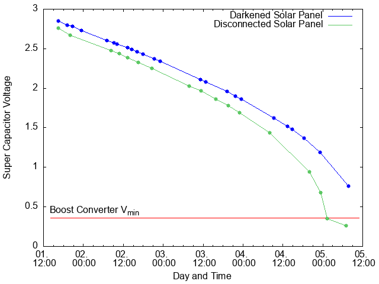

+++
title = "Replacing a Battery with a Solar Panel and a Super-Capacitor"
date = "2020-08-03"
tags = [
    "CR2032",
    "solar",
    "super-capacitor",
    "boost-converter",
    "electronics",
]
toc = true
+++

CR2032 batteries usually power devices with very low energy requirements. A typical use-case for such a battery is, keeping an internal clock active even if the main power supply is not available. The device will be able to maintain the correct date and time even when turned off and not connected to any other power source. An example device that makes use of this is a common mainboard - an essential part of every computer.

The device I selected to equip with a solar-powered circuit instead of the build-in CR2032 battery is the Mi Flora plant sensor.
It is powered by a single CR2032 battery which lasts at least 6 months when the sensor is used once every 10 minutes. See my other post on <a href="" target="_blank">Mi Flora based plant monitoring</a>.

## Buffer

I planed to use a small 3 V solar cell to collect the energy from the sunlight. A single cell should be (far) more than enough to power a sensor. The solar power yield is far less during the night or on a cloudy day. Therefore, I added an energy buffer to store excess energy for periods with low yield. A standard battery was my initial idea, but that would suffer from the environment as the CR2032 battery did (constantly changing temperatures). I ended up selecting a super-capacitor for that purpose. It is nearly not affected by changing temperatures and it can deal nicely with getting charged and discharged constantly.

To prevent the super-capacitor from discharging through the connected solar cell, a diode must be added that allows the flow only into the super-capacitor. It also has the nice benefit of reducing the maximal voltage provided by the solar cell. The super-capacitor is only rated for a maximum of 3 V, but the solar cell has an open-circuit voltage in direct sunlight of about 3.4 V. A diode drops about 0.6 to 0.7 V, therefore, the theoretical maximal voltage that could be delivered to the super-capacitor is 2.8 V. Indeed, I measured this voltage in the super-capacitor on a very sunny day.

## Regulator

The core of the regulator element is the MCP1624. It is a step-up DC-DC converter that can keep operating with an input voltage of only 0.35V, so it is ideal for this project. For more details, see the <a href="https://ww1.microchip.com/downloads/en/DeviceDoc/40001420D.pdf" target="_blank">Microchip datasheet</a>. The regulator circuit is quite simple, if  you like to know more, please check the "Typical Application" example in the datasheet.

## Circuit

This basic schematic shows the final assembly. The Mi Flora plant sensor is attached to the output of the boost converter.

## Testing & Measurments

The following image shows the charging curve of the super-capacitor in direct sunlight. I had to stop the measurement after about 4 minutes because some clouds blocked the direct sunlight. To summarize, it takes only about 5 minutes in direct sunlight to charge the super-capacitor to capacity.

In the second test, I darkend or disconnected the solar panel, after the super capacitor was fully charged. With this, I attempt to simulate bad weather (darkend solar panel) or the worst case scenario.
The voltage in the super capacitor drops slowly, as the Mi Flora plant sensor keep operation normally. With the disconnected solar panel, the super capacitor holds enough charge to supply the sensor for more than 4 days. The bad weather simulation with the darkend solar panel turned out to last about a day longer.

