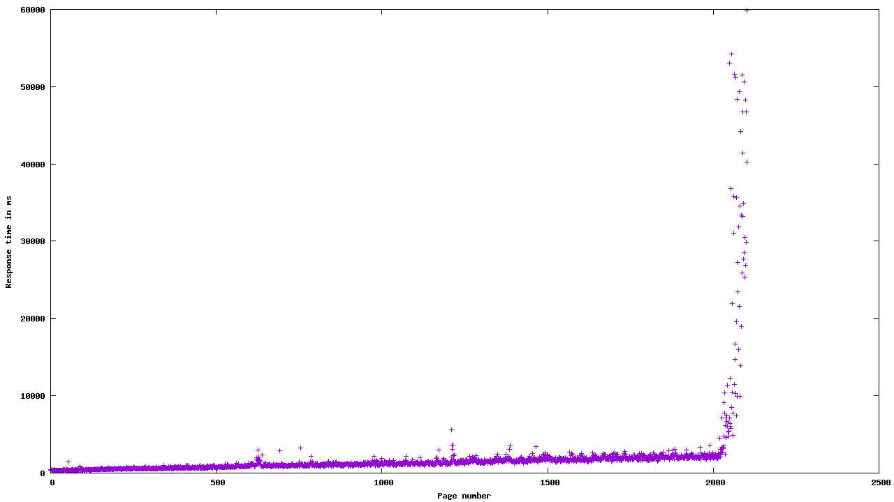
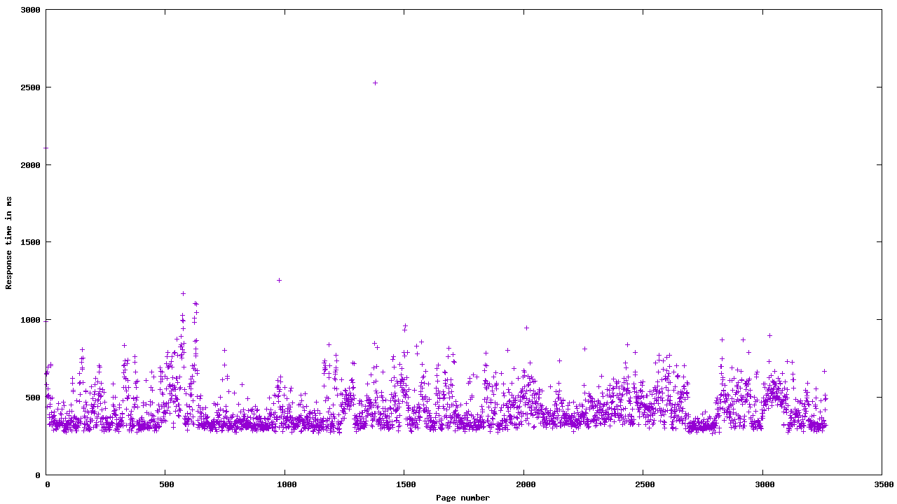

+++
title = "Cursor-based Pagination on Multiple Fields with MongoDB"
date = "2024-02-26"
tags = [
    "pagination",
    "cursor",
    "mongodb",
    "index",
    "aggregation"
]
+++

Cursor-based pagination can offer great performance on large datasets when an index can be used efficiently.
With a single field, as cursor and sort criteria, the implementation is straight forward. Tutorials can be
found all over the internet.

But with multiple cursor fields, the filter criteria and sort order is not as simple,\
especially if an index is to be used for optimal performance.

<!--more-->

## Dataset and Index

In this article, I will assume that all documents in the MongoDB collection have the fields `a` and `b` which are the
criteria for the pagination.

```json
{
  "_id": "507f191e810c19729de860ea",
  "a": "2024-02-26",
  "b": "14:10:30.213Z"
}
```

The index must be created like this:

```js
db.example.createIndex({ "a": 1, "b": 1 }, { unique: true });
```

With these preparations done, lets look at how to query the data.

## Basics of Cursor-based Queries

For single field cursor-based pagnation, the query is straightforward.
The last seen value of the cursor field is used as the cursor for the next page.
Finally, the query must be sorted by the field used for the cursor.

For example, if field `a` is the cursor field:
```js
db.example.find({ "a": { "$gt": "${cursor}" } })
  .sort({ "a": 1 })
  .limit(100)
```

If the cursor is compound by multiple fields, which only in combination uniquely identify a document.
The complexity arises because the first field alone, matches multiple documents, not just one. Within
this *group of documents*, only the second field uniquely identifies a document. 

First, the sort order must be changed appropriately. Both fields must be considered to form a stable order.

Second, the filter criteria must take into account, that there are two situations:

1) The cursor points to the first document of a *group* (all documents matched by field `a`)
2) The cursor points to any other document in a *group*

To illustrate this, see the following visualisation of a collection:


These two sitations are represented in the filter query like so:

1) **Either** `{ "a": { "$gt": "${cursor.a}" } }`
2) **or** `{ "a": { "$eq": "${cursor.a}" }, "b": { "$gt": "${cursor.b}" } }`

## Naive Query with Find

On single field cursor-based pagination, MongoDBs `find` will just work fine. So lets see how it performs on this multi field query:

`${cursor.a}` is the placeholder for the cursor value of field `a`.

```js
db.example.find({ "$or": [
  { "a": { "$gt": "${cursor.a}" } },
  { "a": { "$eq": "${cursor.a}" }, "b": { "$gt": "${cursor.b}" } }
] })
  .sort({ "a": 1, "b": 1 })
  .limit(100)
```

Unfortunately, this approach does not work efficiently. MongoDB cannot use the index to query the data with this `$or` expression
while still using the index to maintain the sort order. Each operation individually can be supported by the index, but not both
at the same time.

Here is a diagram showing the performance of such a query by measuring the the response time of an HTTP endpoint.



It is pretty obvious, that the response time slows linearly until some threshold is hit and the performance drops exponentially.
My interpretation, the threshold is the available main memory of the system. As long as all the data fits into memory,
the response time grows only linearly because the amount of data to be processed also increases linearly with each page.

As soon as the memory is saturated, paging occurs, which dramatically decreses performance and increases the response time.

A linear increasing response time is a pretty good indicator that the index is not properly used for the entire query.

## Performant Query with Aggregate

The idea behind this aggrregation-based query is to perform two filter operations. The first, will jump very close to the right position. It will be either directly at the right position or a little before that. The second filter operation is the same as in the naive query.

Although this sounds more complicated, it allows MongoDB to utilize the index sort and the first filter operation. This is because the first filter operation does not include any `$or` condition.

The second filter operation will not supported by the index, but this is no big deal as there are not so many documents left to filter out anymore.

```js
db.example.aggregate([
  { "$sort": { "a": 1, "b": 1 } },
  { "$match": { "a": { "$gte": "${cursor.a}" } } },
  { "$match": 
    { "$or": [
      { "a": { "$gt": "${cursor.a}" } },
      { "a": { "$eq": "${cursor.a}" }, "b": { "$gt": "${cursor.b}" } }
    ] },
  },
  { "$limit": 100 }
])
```

Here is the same performance test as before (please note that the scales at the x and y axes differ to the previous picture):



The response time of the system is not pretty stable. There are a few variations but this is expected since a real cloud system was tested.

## Alternatives

As an alternative to such an aggregation with a compound cursor, a generated field would also work well. If the data used for the cursor is static, this might even be a preferable solution since it keeps the code and cursor simple.

The downside of such an approach is the additional data required to store such a generated field.